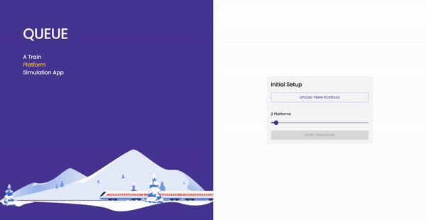

# Queue

Queue is a railway station platform simulation application.



## Run the app

Firstly, install all the dependencies by running:

```bash
npm install
```

Then,

To run the application in _dev_ mode:

```bash
npm run dev
```

This spins up a development server at [localhost:5173](http://localhost:5173/)

To _build_ the app:

```bash
npm run build
```

This generates an optimised build in the _dist_ directory at the root of the project.

To preview the production build:

```bash
npm run preview
```

## Tech Stack

- React
- Vite

## Other libraries
- Recoil - State Management
- Wouter - Router
- Material UI - Components


## Known bugs

- Sometimes, the update function freezes some platforms.
